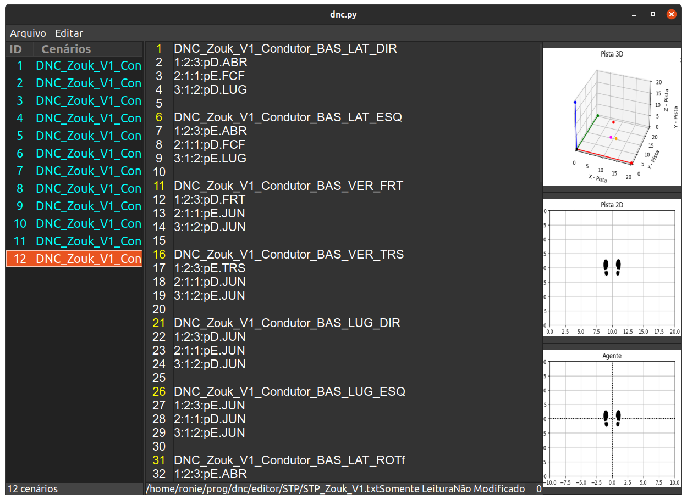

# Projeto Dance Footwork

"A dança começa nos pés e sobe para o corpo".

## Criação do Ambiente

### Esse projeto utiliza um ambiente virtual chamado vDNC

> python3 -m venv vDNC

#### Arquivos sh
Se quiser copiar e alterar dnc.sh para sua pasta home $ de modo a acessar a pasta com o ambiente virtual env ativo mais rapidamente.

#### Requisitos

Vamos para os requisitos, ou seja, o pip-list:

		pip install selenium
		pip install numpy
		pip install pandas
		pip install bokeh
		pip install sklearn
		pip install nltk
		pip install --upgrade google-api-python-client google-auth-httplib2 google-auth-oauthlib

		sudo apt install libgirepository1.0-dev gcc libcairo2-dev pkg-config python3-dev gir1.2-gtk-3.0 

		pip3 install pycairo
		pip3 install PyGObject
		pip3 install pyperclip
		pip install matplotlib
		pip install pytz
		pip install Unidecode

		sudo apt-get install graphviz graphviz-dev
		pip install pygraphviz
		pip install pydot
		
		pip install django

#### Editor

Acesse:

        cd editor
        python dnc.py

E o editor será aberto!

#### Passos Fundamentais

Cheguei à conclusão de que vou precisar revisar alguns passos fundamentais
especialmente para produzir passos do samba.

        %matplotlib notebook
        import stepPlot as sp
        Condutor = sp.ClasseAgente('Condutor',True,10,10,5,0)
        Condutor.plotaAgente(20)
        Condutor.agenteDoStep('pD','ABR')
        Condutor.agenteDoStep('pE','JUN')
        Condutor.agenteDoStep('pD','ABR')
        Condutor.agenteDoStep('pE','JUN')
        Condutor.plotaAgente(20)

## Diário

Leia meu [Diário](diario-dnc.md) de desenvolvimento desse sistema para mais informações.

